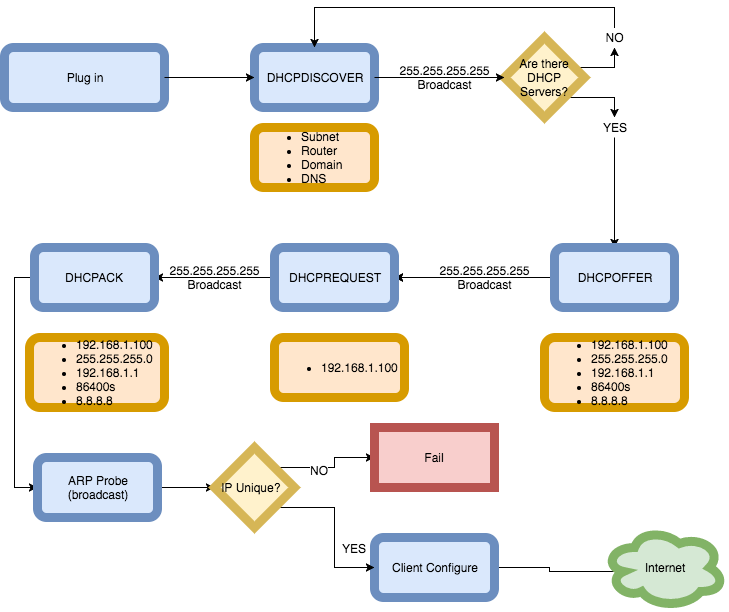
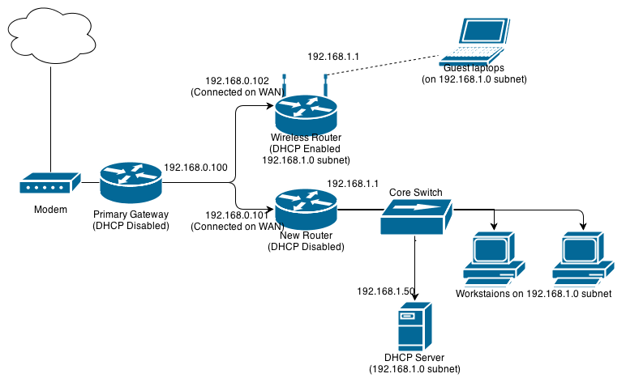
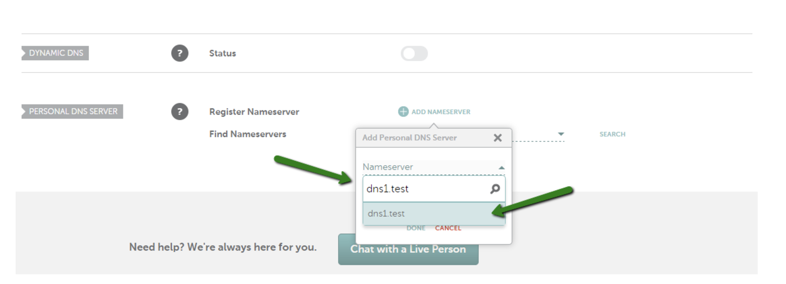

# DNS Tools and U
## Stop doing things the hard way
Start doing them the really hard way.


## How does my laptop get "online?"
### Through DHCP!
* DHCPDISCOVER - client
* DHCPOFFER - server
* DHCPREQUEST - client
* DHCPACK - server


## Broadcast and Unicast
Broadcast - everyone!

Unicast - one-to-one

Note: 
Anycast, multicast (black magic)


### The information in DHCP

1. IP Address
1. Subnet
1. Gateway
1. DNS
1. A bunch of other things

For more information see [RFC 2131](https://www.ietf.org/rfc/rfc2131.txt)


### IP Address

A unique (to the network) address

192.168.0.100/32

Note:
This is a unique network address that can
be routed to/from. IPv6 promotion. NA
is out of free IPv4 space. "No" unique
addresses left at ARIN in v4.


### What's a subnet?

* CIDR - 192.168.0.0/24
* Subnet Mask - 255.255.255.0
* Broadcast address 192.168.0.255

Note: 
Subnets are important because there is constant
"chatter" going on between hosts. They are constantly
broadcasting information to other hosts in their network,
and processing. It reduces packet collision. It's also used
for better control, organization and security.


## ARP
Clients also need to ARP after receiving address from
DHCP

Address Resolution Protocol

A type of broadcast

The client reaches out to all hosts on the subnet
to detect address conflicts


### Gateway

A 'gateway' is just another name for a router.

A host that will forward requests outside of its subnet.

Scenario:

* Host has address 10.1.40.100
* Subnet is /24 - 10.1.40.0-10.1.40.255
* Target is 10.2.30.100


## Use a gateway

Hosts know need to know which is the next hop
for a given subnet. Most networking relies simply
on a `default` gateway.

```
Internet:
Destination        Gateway            Flags        Refs      Use   Netif Expire
default            10.5.0.2           UGSc           22        0     en0
```

Note:
If I'm in my subnet, I go straight to the host,
if I'm outside, then I need to find the gateway.








## Is the network up?
Some tools that are very useful for
network troubleshooting

* `ping`/`ping6`
* `traceroute`/`traceroute6`
* `mtr`
* `arping`
* [subnet calculators](https://www.wolframalpha.com/input/?i=10.1.0.0%2F24)

Note: Arping requires networking to be up and running


## Online. Now What?

Visit a website by using DNS!

https://google.com

```
nameserver 75.75.75.75
nameserver 75.75.76.76
```


### Go to google

https://google.com

```
whois google.com | grep "Name Server"
   Name Server: NS1.GOOGLE.COM
   Name Server: NS2.GOOGLE.COM
   Name Server: NS3.GOOGLE.COM
   Name Server: NS4.GOOGLE.COM
```


## Something's Wrong!


### Glue Records
```txt
Your browser: 
Hi! I need the IP address of example.com. What is it? 

.com nameserver: 
I don't know, but you can ask its nameserver. It was 
ns1.example.com the last time I checked. 

Your browser: 
Thanks! Okay, in order to send a query to ns1.example.com,
I need its IP address. What is it? 

.com nameserver: 
I don't know, but you can ask its parent example.com. 

Your browser: :-(
```


### Glue Records cont'd
Glue records put A records for your custom NS
in the registrar's DNS.


#### Register your NS




### New Glue
This creates an A record in the tld zone.

```
dig +trace +additional google.com SOA
...
ns2.google.com.         172800  IN      A       216.239.34.10
ns1.google.com.         172800  IN      A       216.239.32.10
ns3.google.com.         172800  IN      A       216.239.36.10
ns4.google.com.         172800  IN      A       216.239.38.10
;; Received 660 bytes from 192.5.6.30#53(a.gtld-servers.net) in 225 ms
```


You also need to create an authoritative record in
the `foo.com` zone.


## Here's what a zone file looks like

Note: Show them a zone file


## Some useful DNS troubleshooting tools
* dig
* host
* whois


## Demo time

Note:
Go over the following
`dig google.com`
`dig google.com +short`
`dig soa google.com`
`dig aaaa google.com`
`dig google.com soa +trace +additional`
`host google.com`
`host $(dig google.com +short)`


# Questions
